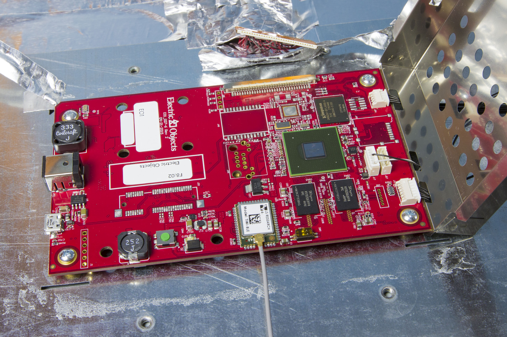

# EO1 Hardware Specficiations

- 21.75"H x 12.98"W x 1.71"D
- 23" 1920x1080 LCD screen
- 17 lbs
- expected lifetime of about 6.85 years
- no Speakers or audio output

The above specs had been published on the [original support page from Electric Objects](https://support.electricobjects.com/articles/215474803.html).

John Ehringer posted [an interesting article on his blog](https://www.5khz.com/2016/05/01/electric-objects-eo1-digital-art-display-teardown/) about tearing appart an EO1 and documented it with high resolution pictures.

