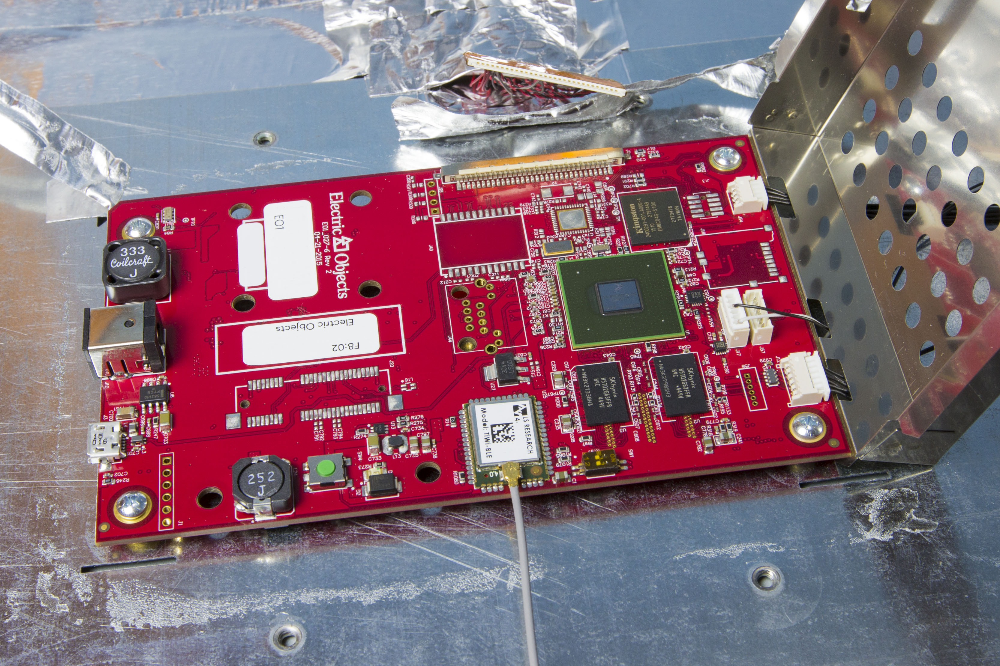

# EO1 Hardware Specficiations

- 21.75"H x 12.98"W x 1.71"D
- 23" 1920x1080 LCD screen
- 17 lbs
- expected lifetime of about 6.85 years
- no Speakers or audio output

## Software notes (Geniatech / API 19)

Do **not** use ExoPlayer (or Media3) for video on these frames. On Geniatech EO1/EO2 hardware running Android 4.4.2, ExoPlayer has been observed to lock up the MediaCodec/GPU driver — the whole device freezes and ADB stops responding until a power-cycle. Video playback in this APK uses platform `MediaPlayer` instead.

The above specs had been published on the [original support page from Electric Objects](https://support.electricobjects.com/articles/215474803.html).

John Ehringer posted [an interesting article on his blog](https://www.5khz.com/2016/05/01/electric-objects-eo1-digital-art-display-teardown/) about tearing appart an EO1 and documented it with high resolution pictures.

