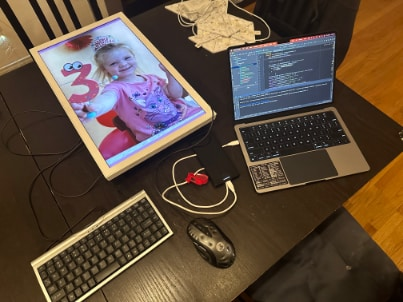
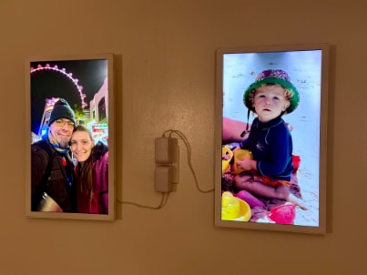
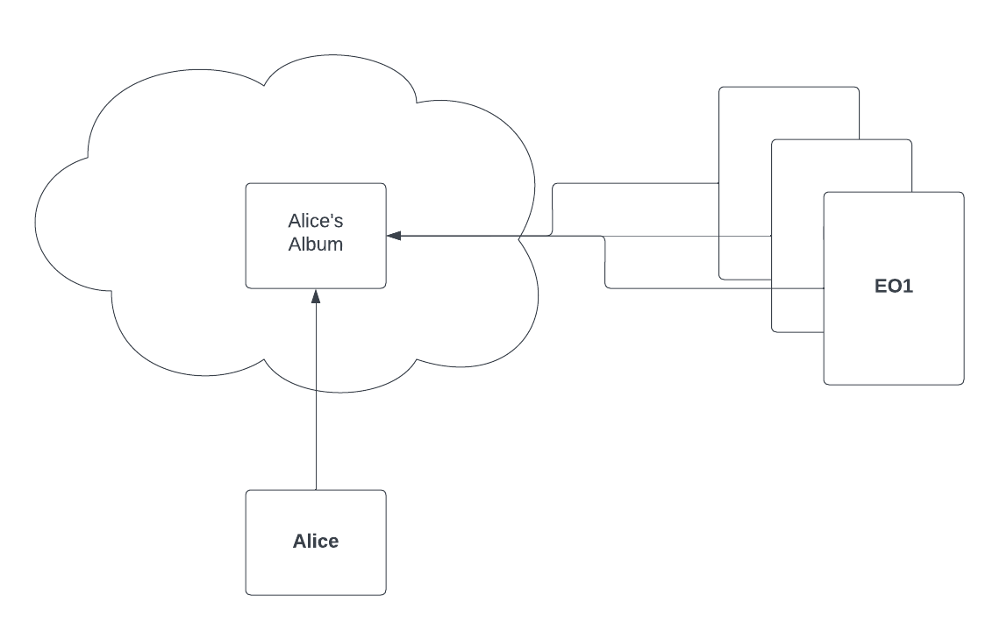
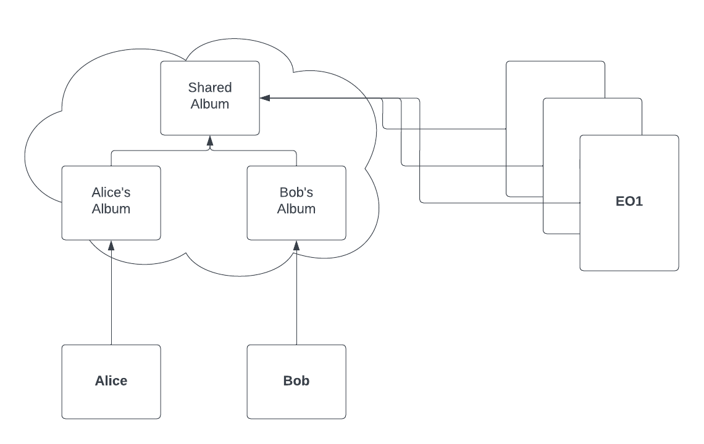

# EO1 Replacement APK

This repository is a fork of [spalt/EO1](https://github.com/spalt/EO1). The goal is to use a
self-hosted [immich.app](https://immich.app/) instance as a backend instead of using Flickr. This will allow **full self-custody** of the system.

 

This concept guarantees that you control all aspects of the images displayed on your EO1 and they will never go offline or stop displaying art ever again, because someone else decided to do so!

## Concept

On your smart device, you will run the immich app for your platform and device. It supports phones and tablets running iOS or Android. The app connects to the cloud hosting an instance of the immich server. You need to host it yourself or have someone host it for you! 

- A simple single-user configuration runs the same user credentials on the EO1 as well as on the smart device.
- In a multi-user configuration, everyone can upload pictures to a shared album which is accessible from the account that is used on the EO1 frames.

 

## Getting started

The following documentation assumes, that you have set up Immich already.

### Requirements

- You need a way to connect a keyboard and mouse to your EO1 frame.  You can get one of these [USB OTG Adapters](https://www.amazon.com/gp/product/B01C6032G0/?&_encoding=UTF8&tag=aph0dc-20&linkCode=ur2&linkId=a2e10d0fcebbd4425ace19f040a24e27&camp=1789&creative=9325) and connect a [USB keyboard with hub built-in](https://www.amazon.com/gp/search?ie=UTF8&tag=aph0dc-20&linkCode=ur2&linkId=56fac2fd57bf775c7512756260c58b6e&camp=1789&creative=9325&index=pc-hardware&keywords=usb) to it, then a USB mouse to the keyboard
    - Alternatively, you can get an [OTG Hub](https://www.amazon.com/dp/B01HYJLZH6?psc=1&ref=ppx_yo2ov_dt_b_product_details&_encoding=UTF8&tag=aph0dc-20&linkCode=ur2&linkId=49938883224aa721262057e366759275&camp=1789&creative=9325) and connect a mouse and keyboard to it directly
- Immich Account Host
- Immich Account Login (Username/Password)
- (optionally) a web server hosting the APK for download onto the frames

#### Caveats

EO1 has only one data port thus OTG and adb (via USB) can not be used at the same time. Unfortunatly the Android OS version 4.4.2 running on EO1 does not support wireless adb connection. That is the reason why the APK has to be sideloaded via the built-in browser.

### Setup

- Upload some pictures to your Immich account
- Connect the mouse & keyboard to your EO1 via the mentioned OTG method
- Connect the EO1 to the power adapter and let it boot
- When your EO1 finishes the boot animation and it hangs on the "Getting Art" dialog, hit **\[WINDOWS + B\]** on the keyboard to open a web browser
- You need to tell your EO1 to allow side-loading. 
    1. Swipe down on the top right and go to **Settings > Security**
    2. Make sure "Unknown Sources" is checked
- Go back to the browser and go to this URL: <http://gitea.codingmerc.com/michael/EO1/releases/download/v1.0.0-rc2/app-release.apk>
  - You can build the app from this repository and host it yourself if you want to not use a precompiled APK
- When it finished downloading, install the file by pulling down the notification bar on the top left and clicking it, then agreeing to the prompts
- Restart/power cycle your EO1 by unplugging and plugging only the power cable
  - At this point, the keyboard and mouse are still connected via OTG
- Because this APK is designated as a "Home screen replacement", when EO1 boots, it will ask if you want to load the Electric Object app or the EO1 app. Select EO1 and choose "Always".
- The first time the EO1 is run you will need to specify the information listed above. Click OK to save and continue. **To get back to the configuration screen later, press C on your connected keyboard**
- You can now unplug your mouse and keyboard and hang your EO1 back on the wall!
