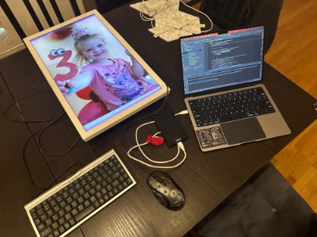
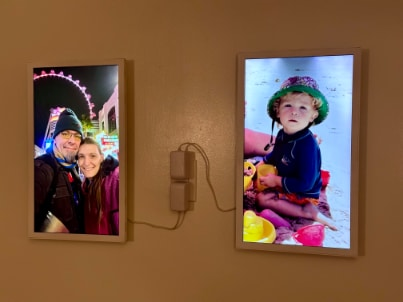
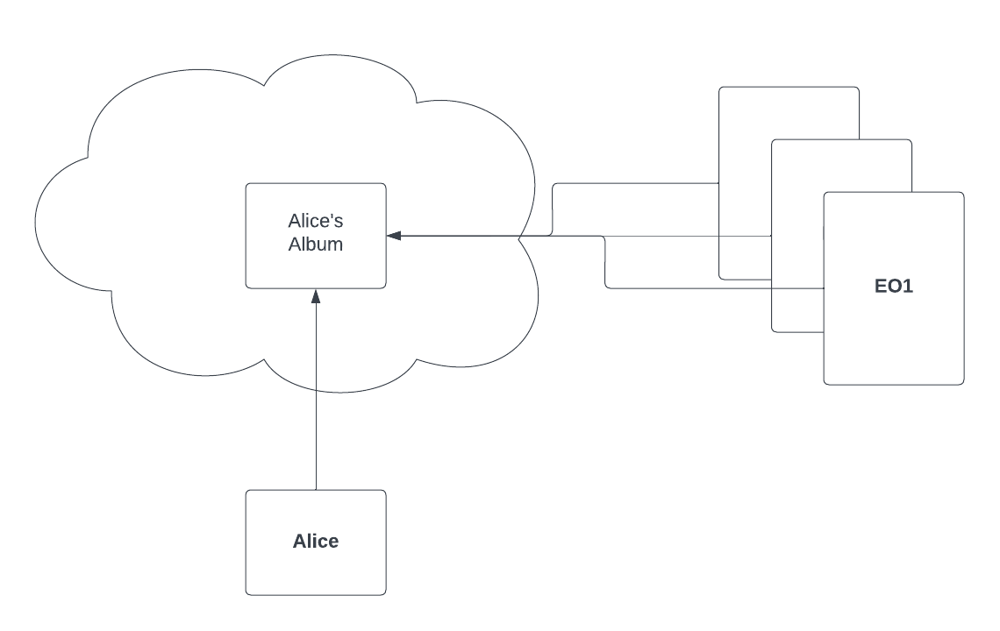
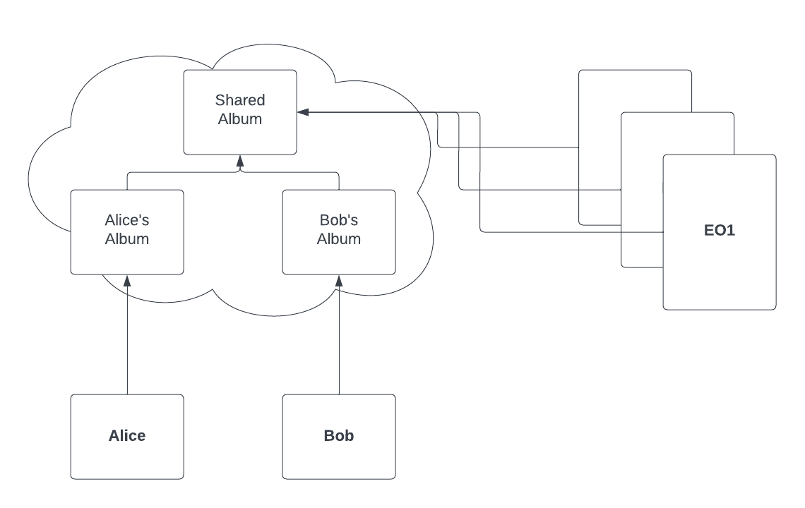

# EO1 and EO2 Replacement APK

This repository is a rewrite of [spalt/EO1](https://github.com/spalt/EO1). The goal is to ideally use a
self-hosted [immich.app](https://immich.app/) instance as a backend. This will allow **full self-custody** of the system.

 

This concept guarantees that you control all aspects of the images displayed on your EO1 and/or EO2 and they will never go offline or stop displaying art ever again, because someone else decided to do so!

## Concept

On your smart device, you will run the immich app for your platform and device. It supports phones and tablets running iOS or Android. The app connects to the cloud hosting an instance of the immich server. You need to host it yourself or have someone host it for you!

- A simple single-user configuration runs the same user credentials on the picture frame as well as on the smart device.
- In a multi-user configuration, everyone can upload pictures to one shared album or several shared albums which is accessible from the account that is used on the frames.
- The client app on the frames will select a random picture from the merged pool of all available pictures across every configured media backend (Immich albums from one or more hosts, plus optionally locally uploaded files).
- A new picutre is chosen every interval.
- A best effort is made that once every picture had been displayed once, the cycle starts anew.

 

## Getting started

The following documentation assumes, that you have set up Immich already.

### Requirements

- Immich server **3.0.0–3.2.2** (verified against the **3.2.2** OpenAPI spec). Immich’s HTTP API changes between releases; newer servers may show an “unsupported” toast until this app is updated to match.
- You need a way to connect a keyboard and mouse to your EO1 frame.  You can get one of these [USB OTG Adapters](https://www.amazon.com/gp/product/B01C6032G0/?&_encoding=UTF8&tag=aph0dc-20&linkCode=ur2&linkId=a2e10d0fcebbd4425ace19f040a24e27&camp=1789&creative=9325) and connect a [USB keyboard with hub built-in](https://www.amazon.com/gp/search?ie=UTF8&tag=aph0dc-20&linkCode=ur2&linkId=56fac2fd57bf775c7512756260c58b6e&camp=1789&creative=9325&index=pc-hardware&keywords=usb) to it, then a USB mouse to the keyboard
  - Alternatively, you can get an [OTG Hub](https://www.amazon.com/dp/B01HYJLZH6?psc=1&ref=ppx_yo2ov_dt_b_product_details&_encoding=UTF8&tag=aph0dc-20&linkCode=ur2&linkId=49938883224aa721262057e366759275&camp=1789&creative=9325) and connect a mouse and keyboard to it directly
- For each Immich backend: the server host and an account login (username/password) — see [Multiple media backends](#multiple-media-backends)
- (optionally) the local uploads backend — no account needed, files uploaded via the frame's [LAN web server](docs/WEBSERVER.md)
- (optionally) a web server hosting the APK for download onto the frames

#### Caveats

EO1 has only one data port thus OTG and adb (via USB) can not be used at the same time. Unfortunatly the Android OS version 4.4.2 running on EO1 does not support wireless adb connection. That is the reason why the APK has to be sideloaded via the built-in browser.

Additionally the old Android 4.4.2 version installed on EO1 supports a limited set of TLS encryption next to a swath of outdated SSL stuff for accessing resources via the web. That means that the immich instance hosting your albums needs to let their guard down at least a litte.
Amongst other things, I had to disable PFS as well as enable TLSv1.2 in addition to modern TLSv1.3. If the app complains about SSL connection errors, it is likely that the immich host and the Android OS don't share at least one compatible cipher and protocol.

### Setup for EO1

- Upload some pictures to your Immich account
- Connect the mouse & keyboard to your EO1 via the mentioned OTG method
- Connect the EO1 to the power adapter and let it boot
- When your EO1 finishes the boot animation and it hangs on the "Getting Art" dialog, hit **\[WINDOWS + B\]** on the keyboard to open a web browser
- You need to tell your EO1 to allow side-loading.
  1. Swipe down on the top right and go to **Settings > Security**
  2. Make sure "Unknown Sources" is checked
- Go back to the browser and go to the URL where you host the APK. All builds are local (there is no CI anymore) — [publish-update.sh](#self-update) builds and signs a release APK and writes a matching `update-manifest.json` to `./update-out`; serve that directory from any plain-HTTP server on your LAN. Example: <http://your-host/update-out/eo1-release-1.apk>
- When it finished downloading, install the file by pulling down the notification bar on the top left and clicking it, then agreeing to the install prompts. That's the one-time bootstrap — every later self-update then runs fully headless (no further manual steps; see [How the install runs](#how-the-install-runs))
- Restart/power cycle your EO1 by unplugging and plugging only the power cable
  - At this point, the keyboard and mouse are still connected via OTG
- Because this APK is designated as a "Home screen replacement", when EO1 boots, it will ask if you want to load the Electric Object app or the EO1 app. Select EO1 and choose "Always".
- The first time the EO1 is run, the options dialog opens on the **Media** tab. Under **Media backends** click **"+ Add Immich backend"** and fill in the fields in the row that expands:
  - Server: the same server URL you use to log in on the web-app or the native apps on iOS or Android
    - If you connect to immich in your browser via `http://immich.local`, that is what you want to use here
    - If you run immich on a different port than `80`, include it in the server string, like `http://immich.local:8080`
  - Username: the same email address you would use to log in on the web-app or the native apps on iOS or Android
    - Depending on how you set up your immich installation this is your own user or a shared user account dedicated for use with the frames
  - Password: same as above
    - Keep in mind that this password is stored in clear-text on the frame. Everyone with access to your device can recover the password!
  - API version: leave blank for `auto` (the frame probes the server's version on first contact) or pin a version like `3.1.0` — see [Multiple media backends](#multiple-media-backends)
  - Pointing the frame at more than one server? Click **"+ Add Immich backend"** again for each additional host. **"+ Add Local uploads"** enables the optional local uploads backend (no credentials needed).
- Press **Save** at the bottom of the dialog. **To get back to the configuration screen later, press C on your connected keyboard**
- You can now unplug your mouse and keyboard and hang your EO1 back on the wall!

### Setup for EO2

Your EO2 most likely has android debugging enabled - which (while insecure) makes it much easier to adjust settings remotely.
This guide assumes your EO2 already has an IP address on your network that is known to you (likely a DHCP reservation). If your EO2 has been reset or isn't connected to your network, [this reddit post](https://www.reddit.com/r/electricobjects/comments/1amitpa/howto_video_for_resurrecting_eo2/) has instructions on getting it online.

- Upload some pictures to your Immich account
- Connect the EO2 to the power adapter and let it boot. It should stop at "Connecting to the internet..."
- Download and install [adb (Android Debug Bridge)](https://developer.android.com/tools/adb)
  1. I was never succesful getting the adb command to work on my Win10 machine - the connection always failed. However it worked from both Windows Subsystem Linux on that machine and my Linux server, so my guess is there's an issue with Windows adb.
- Connect to your EO2
  1. `adb connect EO_IP_ADDRESS`
- Disable the EO2 app
  1. `adb shell pm disable com.electricobjects.app`
- Download the latest release apk from this repo and install it using this command:
  1. `adb install -r PATH/TO/eo1-app-release.apk`
- At this point, when you reboot your EO2, the configuration window should pop up. You can either attempt to connect a keyboard to the EO2 to edit the file directly, or follow these instructions to create the configuration.json file manually
  1. open the configuration_example.json from the root of this repo (either clone the repo or copy-paste the contents to a new text file)
  2. adjust the values for your setup — the file now carries a `backends` list (one entry per Immich host, plus an optional `local` entry); see [Multiple media backends](#multiple-media-backends) below. If you have multiple EO2s, see the section around managing multiple EO2s with immich
  3. once the file is edited with your preferences, copy it to the EO2 with the following command:
  4. `adb push PATH/TO/configuration.json /data/data/com.aphex3k.eo1/files/configuration.json`
- Reboot your EO2 with the following command:
  1. `adb reboot`
- When your EO2 reboots, it should connect to the server and grab some art!
- If you used the electricobjects website in the past to download and display art, please [share your cached art with the world!](https://www.reddit.com/r/electricobjects/comments/16umi1m/eo2_saving_your_art/)

### Managing multiple EO2s with immich

In a situation where you will want to manage multiple EO2s (or when you want to have granular control on what a single EO2 displays) you'll want to create an immich account for **each EO**. These accounts should be separate from your master (admin) account that manages the immich instance.
In the immich Administration area, click the "Create User" button and name it for the EO2 (eg EO2-LivingRoom). _at the point of writing this, each account requires a separate email address, however in my testing this address is not used and does not need to be verifed. If this changes in future versions of immich, you'll have to provide unique emails for each EO._
Use the created email/password combo for each EO2 as that device's `immich` backend entry in its `configuration.json` (one backend per device is the typical setup; extra backends can be added in the file or the options dialog)
Create separate albums for your pictures - either organized as previously on the electricobjects website (each album is a playlist) or create albums specific for each device
Choose the album you want to show on each device, click the Share icon in the up-right of the immich app, and choose the account associated with the device.
The app will only be able to see content from your immich database that is shared with it.

### Multiple media backends

The frame's configuration holds a list of **media backends**; the rotation pool merges the catalogs of all of them and picks randomly across the combined set. Any number of Immich hosts is allowed, plus one optional **local** backend for files uploaded through the frame's [LAN web server](docs/WEBSERVER.md) — it joins the rotation as an equal peer and needs no account.

Template: [`configuration_example.json`](configuration_example.json).

```json
{
  "selectedTimeZoneId": "America/Los_Angeles",
  "quietHours": ["* 22-23,0-6 * * *"],
  "interval": 15,
  "backends": [
    { "type": "immich", "id": "immich-1", "host": "http://immich.local/", "userid": "frame1@example.com", "password": "secret", "apiVersion": "auto" },
    { "type": "immich", "id": "immich-2", "host": "https://other.example.com:3001/", "userid": "frame2@example.com", "password": "secret", "apiVersion": "3.1.0" },
    { "type": "local", "id": "local" }
  ]
}
```

- **`apiVersion`** — per backend, so one frame can point at servers of different vintages. `"auto"` (the default) probes the server's version on first contact and uses the matching client; a pinned semver like `"3.1.0"` skips the probe and selects the client for that band (the current band is **3.0.0–3.2.2**). A pin or probed version outside the supported band disables just that backend with a toast; the others keep rotating.
- **Local backend** — optional, at most one (`"type": "local"`). Files uploaded through the web server appear in the rotation on the next interval tick, no restart; deleting a file drops it out.
- **Quiet hours** — `quietHours` is a list of 5-field cron expressions (`minute hour day month weekday`); the screen is off whenever any entry matches the current minute in `selectedTimeZoneId`, so overlapping windows simply OR. `* 22-23,0-6 * * *` = off every night 22:00–06:59; `0 13 * * 1-5` = off weekdays at 13:00. Old `startQuietHour`/`endQuietHour` values are migrated to the equivalent expression on load; a single whole-hour window is mirrored back into those fields on save so older APKs keep working.
- **Legacy configs** — an old file with flat `host`/`userid`/`password` is migrated on load to a single `immich-1` backend and rewritten on disk; the flat fields are kept mirrored on save so older APK versions can still read the file.
- **Editing** — the options dialog's Media tab (press **C** on a connected keyboard on EO1) manages the list: add/remove Immich backends, add/remove the local one, and edit host/username/password/API version per row. Or edit `configuration.json` directly and reboot (EO2).
- If a backend's server is unreachable or a credential is wrong, that backend is skipped for the cycle and the rest keep rotating.

### Local debug (emulator)

Clone with Git LFS so the Amlogic TsPlayer native library is present:

```bash
git lfs pull
```

Modern Android Studio no longer supports the Gradle/SDK pins this project needs for IDE debugging. Use:

```bash
./debug.sh
```

That builds the debug APK (armeabi-v7a carries the Amlogic TsPlayer `.so`; arm64-v8a is a native-lib-free emulator fallback), creates or reuses an AVD named `EO1` (API 19) constrained like the real hardware, installs and launches the app, then attaches to logcat. Press **Ctrl+C** to stop and quit the emulator.

On **Apple Silicon**, API 19 images generally cannot boot, and 32-bit ARM emulators are unsupported. After API 19 fails, the script falls back to AVD `EO1_API21` (`system-images;android-21;default;arm64-v8a`). The committed LFS TsPlayer `.so` is **armeabi-v7a** only (EO1 hardware); the arm64-v8a fallback has no native player, so the app falls back to `MediaPlayer` there. That path is an approximation for development, not EO1 fidelity. Debug APKs omit `maxSdk` so they can install on the fallback AVD; **release** builds still use `maxSdk 19` and armeabi-v7a only for real devices.

## Self-update

The frame can check for, download, verify and install a new APK by itself — no adb, no OTG
peripheral, no touch screen. Updates are forward-only (the manifest's `versionCode` must be
strictly greater than the installed one) and nothing is installed before every verification
gate passes.

### Configuration

Two fields in `configuration.json` (also in the options dialog, Media tab):

- `updateManifestUrl` — plain-HTTP(S) URL of a small JSON manifest. Empty (the default)
  disables self-update entirely.
- `updateCheckIntervalMinutes` — poll interval in minutes (default 120, clamped to [5, 1440]).

The manifest (exactly the fields `publish-update.sh` writes):

```json
{
  "versionCode": 2,
  "versionName": "1.3.1",
  "apkUrl": "http://your-host/update-out/eo1-release-2.apk",
  "sha256": "<64 hex chars>",
  "sizeBytes": 12345678,
  "notes": "EO1 1.3.1"
}
```

### Verification chain

1. **Manifest gate** — `apkUrl` must be http(s), `sha256` 64 hex chars, `sizeBytes` positive
   and ≤ 100 MB, `versionCode` strictly greater than the installed one.
2. **SHA-256** — the downloaded bytes are hashed in a 32 KB streaming loop and must match the
   manifest before anything else is checked.
3. **JAR signature** — `META-INF/MANIFEST.MF` + `.SF` + `.RSA` are verified in pure Java
   (`com.aphex3k.update.ApkSignatureVerifier`): per-entry digests, the whole-manifest digest
   and the PKCS#7 signer signature.
4. **Signer-certificate match** — the leaf certificate extracted from the JAR signature must
   byte-match the certificate of the *installed* APK, i.e. the update must be signed with the
   same keystore as the current install. (An unsigned installed app has no certificate to
   match against; updates then fail with `no-installed-cert`.)

Only after all four gates does the APK get staged (private master in `filesDir/updates/` plus a
world-readable copy at `/sdcard/Download/eo1-update.apk`, because the installer runs under a
different uid) and then installed.

### How the install runs

- When the frame holds `INSTALL_PACKAGES`, the APK is installed headlessly via
  `PackageManager.installPackage`. On this ROM the permission is `signature|system`, so
  sideloaded frames never hold it — for them the app instead runs `pm install -r` as the
  shell user through the device's own adbd on `127.0.0.1:5555` (`AdbdInstallClient` speaks
  the minimal adb wire protocol; no confirmation UI). Only when adbd is unreachable does
  the app fall back to the proven install intent, waking the screen for a human to confirm.
- Before firing, a +120 s `AlarmManager` relaunch alarm (the same one the crash handler uses)
  is armed, so a fatal crash mid-install still gets the frame back to a launchable state.
- The installer kills this process on success, so success is detected by the *new* process on
  startup: the persisted expected `versionCode` is compared against
  `BuildConfig.VERSION_CODE` (`reconcileOnStartup`). A stuck or refused install rolls back to
  the retryable `STAGED` state and is retried on the next timer tick.

### Recovery (headless, via the LAN web server)

| Symptom | Action |
|---|---|
| Need to see where an update stands | `GET /state` → `update` block: `state`, `expectedVersionCode`, `lastError`, `attempts`, `installMode`, `lastInstallAttempt` (`none`/`headless`/`adbd`/`intent`), `adbdReachable` |
| Staged but not installed | `/control?action=install-staged` (turns the screen on and fires the install) |
| Stuck / looping on a bad APK | `/control?action=update-reset` (deletes staged files and state) |
| Force a re-check now | `/control?action=check-updates` |

The index page exposes **Check updates** / **Install staged** / **Update reset** buttons.
Recovery is forward-fix only: a failed update leaves the last good version running; the app
never downgrades or uninstalls itself.

### Publishing a new version (operator side)

All builds are local — the old Jenkins/Gitea pipeline no longer exists. Signing uses the
release keystore (alias `EO1`, the same one the old CI used) via the gitignored root
`local.properties`:

```properties
eo1.signing.store.file=/path/to/eo1-release.keystore
eo1.signing.store.password=...
eo1.signing.key.alias=EO1
eo1.signing.key.password=...
```

Then publish:

```bash
EO1_UPDATE_HOST=http://your-host/eo1 ./publish-update.sh 2 1.3.1
```

The script enforces a monotonic `versionCode` (strictly greater than the last published one),
builds with `assembleRelease`, hashes with `shasum -a 256`, writes `update-manifest.json` and
stages both files in `./update-out` (optionally rsync'd to `EO1_UPDATE_REMOTE`). Serve that
directory from any plain-HTTP server the frames can reach and point `updateManifestUrl` at
`…/update-manifest.json`.

> The frames cannot validate TLS (device certificates are expired), so keep the update host on
> a trusted LAN. A LAN attacker who can rewrite the manifest or APK is still stopped by the
> signer-certificate match — a new APK must be signed with the release keystore.

## Further Reading

1. [EO1 Hardware specifications](EO1-specs.md)
1. [AGENTS.md](AGENTS.md) — repository map for AI coding agents

## Contribution

1. You can provide feedback by opening [Issues](https://github.com/aphex3k/EO1/issues) and describing an idea or problem.
1. You can donate in Dollar via [PayPal](https://www.paypal.me/aphex3k) or in [Bitcoin](https://getalby.com/p/michaelhenke).
1. If you happen to have a working but no longer needed EO1/EO2 picture frame, please reach out via email!
